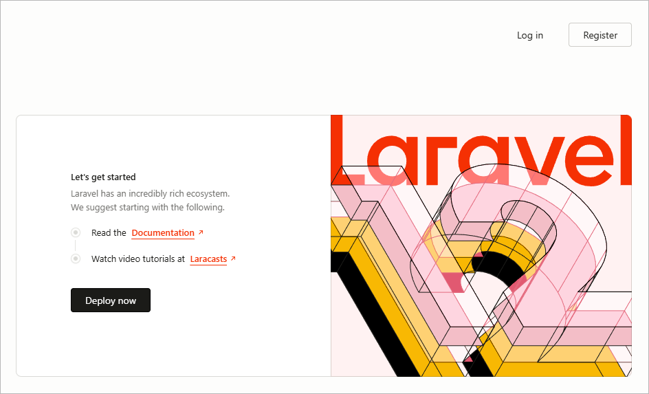
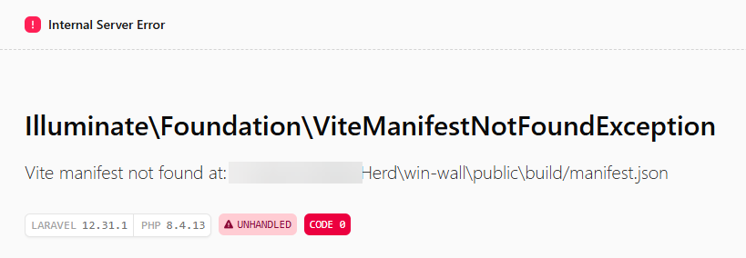

## Testing 1,2,3.
Now that we have our site up and running, let's check that everything is running smoothly.

{}
If you have an error and don't see something similar to the below when opening in browser, contact a mentor to help you troubleshoot.
{}

### Testing our authentication
One of the best things about Laravel is that it comes with secure, configurable authentication (the ability for users to log in with their own dedicated user credentials) out of the box. We can test this by hitting the **Register** button in the top right of our page. If everything is working correctly, this should take you to a Register page that looks something like this:

{}
If you get an error page similar to the below when attempting to register, it means that Herd was unable to start one of the required bits to make our project fully work in the browser. 

Don't freak out! It's time to feel like a hacker 😎

We can manually start the missing bit by following these steps:

{}
- In Laravel Herd, on your site, click the Terminal **Open** button
- Type the command `npm install` and hit Return/Enter
- Type the command `npm run dev` and hit Return/Enter
- Retry accessing the Register page in your browser. It should now work as expected!
- If you don't see the Register page content, ask a mentor for help.

{}
{}
- Go to the Start menu and search for 'cmd'. Open **Command Prompt**. 
- In Herd, right click on the Path (it will look something like `C:\Users\yourusername\Herd\win-wall`) then switch to your Command Prompt and type `cd` followed by a space, then right click to paste your path. Hit Enter.

_**Note:** Clicking the Terminal Open button from inside Herd will open Powershell, and the following command prompts will not work in Powershell. Make sure you are in a regular Command Prompt or Bash terminal._

- Type the command `npm install` and hit Return/Enter
- Type the command `npm run dev` and hit Return/Enter

{}



{}

Next: [Views and Routes](/laravel/views_and_routes/)

