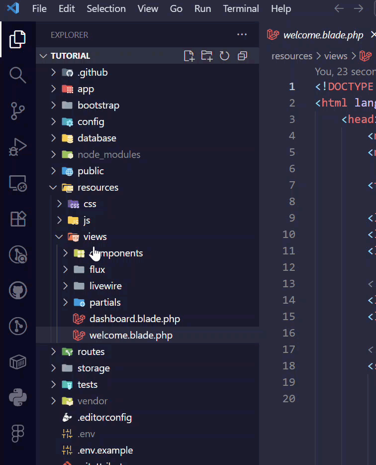
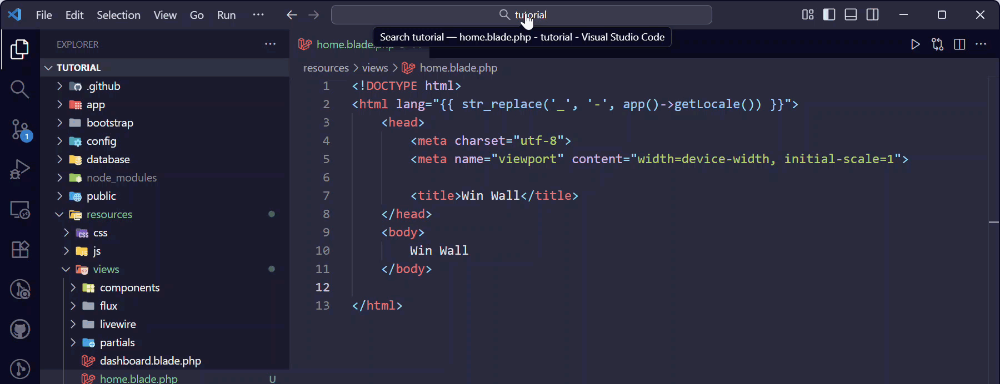

## Views and Routes

Congrats, you've already got a fully feature-rich web application! Unfortunately it currently doesn't look much like a Win Wall, so let's start personalising it to match our vision.

The first thing we are going to customise is our welcome page. A neat trick when we are learning a new coding language or framework is to inspect and investigate code that already exists, to see how it is put together. We can work out some of the structure of our application by doing a simple search in VS Code for some words on the welcome page. Click on the magnifying glass on the left hand side in VS Code to open the search, and type in a few words you can see, such as "incredibly rich ecosystem".


We can change this text to whatever we want, and when we save the file we can see that it will have changed on our Welcome page!

{}
Todo: gif of searching, finding welcome blade, and updating to 'welcome to win wall'
{}

## Blade Files
Simple static web pages can be created with plain HTML, but this can quickly become limiting. For example, we will often want to include a header at the top of all of our pages and a footer at the bottom, but we don't want to rewrite that code in every single page. We can use a programming language such as PHP to help us include our header and footer in every page, but when we do this using traditional 'vanilla' PHP, it's quite ugly and messy.

Laravel includes a neat tool called the Blade Templating Engine, which allows us to cleanly and elegantly achieve this and more with very little code, in a way that is super easy to read.

Think of Blade as HTML with superpowers! You can:
- Write regular HTML just like you're used to
- Insert variables and dynamic content using `{{ }}`
- Use simple directives like `@if`, `@foreach`, and `@include`
- Create reusable components and layouts so you don't have to repeat things - like the same header/footer code - on every page.

All Blade files end with `.blade.php` (like `welcome.blade.php`), which tells Laravel to process them with the Blade engine before sending them to the browser. When Laravel processes a Blade file, it converts all those special Blade features into regular PHP, and then into HTML that your browser can display.

### PHP vs Blade: A Quick Comparison

Let's look at how you would create a simple welcome page using traditional PHP compared to Blade:


{}

```

<body>
    <?php include('header.php'); ?>
    
    <h1>Welcome, <?php echo htmlspecialchars($username); ?>!</h1>
    
    <?php if ($userIsAdmin) { ?>
        <p>You have admin access.</p>
    <?php } else { ?>
        <p>You are a regular user.</p>
    <?php } ?>
    
    <ul>
    <?php foreach ($items as $item) { ?>
        <li><?php echo htmlspecialchars($item); ?></li>
    <?php } ?>
    </ul>
    
    <?php include('footer.php'); ?>
</body>

```

Notice how the PHP tags `<?php ?>` interrupt the HTML constantly, and you need to remember to use `htmlspecialchars()` to prevent security issues.

{}
{}

```
<body>
    @include('header')
    
    <h1>Welcome, {{ $username }}!</h1>
    
    @if ($userIsAdmin)
        <p>You have admin access.</p>
    @else
        <p>You are a regular user.</p>
    @endif
    
    <ul>
    @foreach ($items as $item)
        <li>{{ $item }}</li>
    @endforeach
    </ul>
    
    @include('footer')
</body>

```

Much cleaner and easier to read! The `{{ }}` syntax automatically escapes output for security, and the `@` directives feel more like natural language.

{}


As you can see, Blade makes your code much more readable and maintainable, and it also comes with some neat security benefits that will make your code less likely to get hacked!

### Creating a Blade File
It's time to create our own custom Welcome Page. This will act as the home page for our Win Wall application - so let's name it `home.blade.php`. 

We are going to create this new file in the same location as the `welcome.blade.php` file that we found earlier, inside the `views` folder.



Our blade file needs something in it to display to the page, so for now you can copy and paste in some starter code:

```html
<!DOCTYPE html>
<html lang="{{ str_replace('_', '-', app()->getLocale()) }}">
    <head>
        <meta charset="utf-8">
        <meta name="viewport" content="width=device-width, initial-scale=1">

        <title>Win Wall</title>
    </head>
    <body>
        Win Wall
    </body>

</html>
```
{}
**Did you know?**
You can use the copy button in the top right of code snippets like the one above to quickly copy and paste into your project!
{}

The code we just pasted in is the bare minimum required for a page view. If you're already used to writing code with HTML, it will look pretty familiar! Now that we have our blade template set up, we need to tell our application to use it as our home page. To do this, we are going to edit a file called web.php. This is a really important file in a Laravel application that tells our server how to connect a specific URL (also called a 'route') to a view that we create. To find this file, type 'web.php' into the search bar at the top of VS Code. We want to change our home page so that instead of the Welcome blade, it displays our new Home blade.



Now go to your application and refresh. You should see a blank page with the word 'Win Wall' on it!

### Styling a Blade File
Now it might feel a bit like our page has gone backward! We've lost all of our pretty styling, and we've just got a plain old piece of text on the page. Not to worry! With a bit of CSS, we can fix that right up!

Our starter kit comes with the Tailwind CSS framework installed. If you aren't familiar with Tailwind, you can read more about it [here](https://tailwindcss.com/). With Tailwind, we can apply pre-built classes to our HTML to quickly style our content. For today you can simply copy and paste the code below, but if you'd like to learn more about working with HTML and CSS, don't forget to check out our [HTML & CSS Tutorial](/html_and_css/?target=_blank)!

```html
<!DOCTYPE html>
<html lang="en">
    <head>
        <meta charset="utf-8">
        <meta name="viewport" content="width=device-width, initial-scale=1">

        <title>Win Wall</title>
        
        @vite(['resources/css/app.css', 'resources/js/app.js'])
    </head>
    <body class="bg-neutral-100 dark:bg-neutral-900 text-neutral-900 flex p-6 lg:p-8 items-center lg:justify-center min-h-screen flex-col">
        <main class="flex flex-col items-center gap-4 bg-white rounded-lg shadow-lg p-8">
            <h1 class="text-2xl font-bold">Win Wall</h1>
        </main>
    </body>
</html>
```

Our updated code includes:
- the import statement for 'Vite' which makes our CSS and JavaScript work
- some classes on our body, main and h1 so that our simple home page looks a little more interesting!

Next: [Components and Layouts](/laravel/components_and_layouts/)
