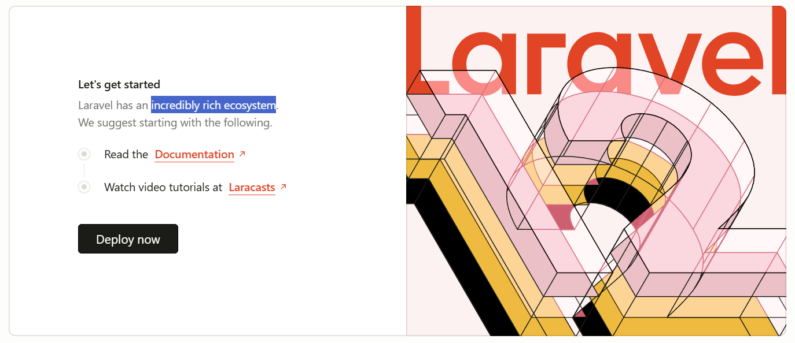

## Views and Routes

Congrats, you've already got a fully feature-rich web application! Unfortunately it currently doesn't look much like a Win Wall, so let's start personalising it to match our vision.

The first thing we are going to customise is our welcome page. A neat trick when we are learning a new coding language or framework is to inspect and investigate code that already exists, to see how it is put together. We can work out some of the structure of our application by doing a simple search in VS Code for some words on the welcome page. Click on the magnifying glass on the left hand side in VS Code to open the search, and type in a few words you can see, such as "incredibly rich ecosystem".

We can change this text to whatever we want, and when we save the file we can see that it will have changed on our Welcome page!

Todo: gif of searching, finding welcome blade, and updating to 'welcome to win wall'

## Blade Files
Simple static web pages can be created with plain HTML, but this can quickly become limiting. For example, we might want to include a header at the top of all of our pages and a footer at the bottom, but we don't want to rewrite that code in every HTML file. We can use a programming language such as PHP to help us include code snippets (in PHP we call these 'includes') but this can get a bit messy.

Laravel includes a neat tool called the Blade Templating Engine, which allows us to cleanly and elegantly achieve with a couple of lines of code what might otherwise take . 

Think of Blade as HTML with superpowers! You can:
- Write regular HTML just like you're used to
- Insert variables and dynamic content using `{{ }}` instead of messy PHP echo statements
- Use simple directives like `@if`, `@foreach`, and `@include` instead of complex PHP syntax
- Create reusable components and layouts so you don't have to repeat the same header/footer code on every page

All Blade files end with `.blade.php` (like `welcome.blade.php`), which tells Laravel to process them with the Blade engine before sending them to the browser. When Laravel processes a Blade file, it converts all those special Blade features into regular PHP, and then into HTML that your browser can display.

**Interesting Beginner Fact:** The `{{ }}` syntax in Blade automatically protects you from XSS (Cross-Site Scripting) attacks by escaping any HTML in variables. This means you can safely display user input without worrying about malicious code being injected into your page - Laravel takes care of the security for you! 