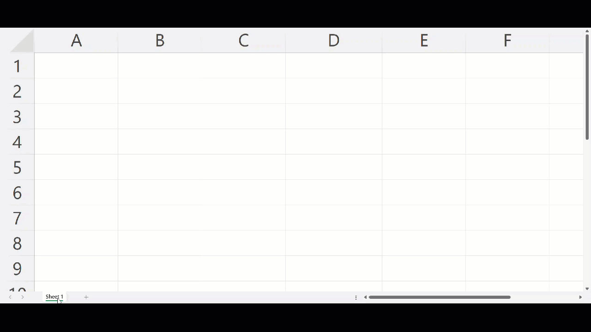
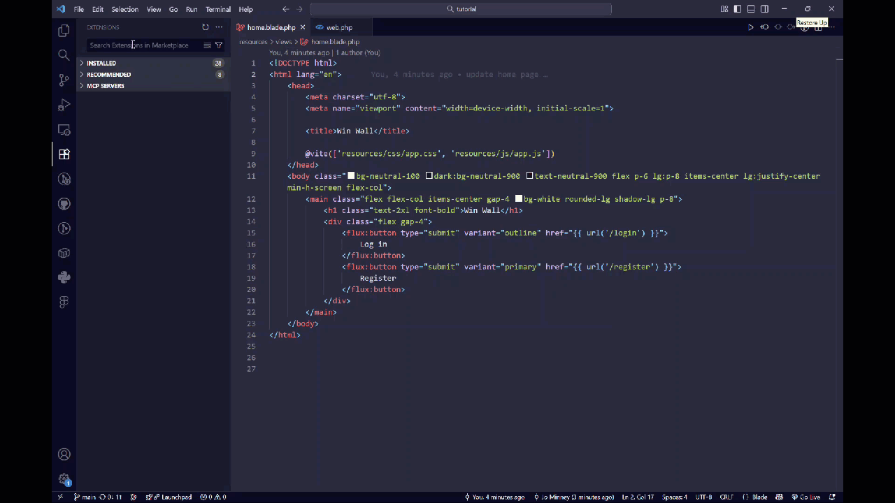
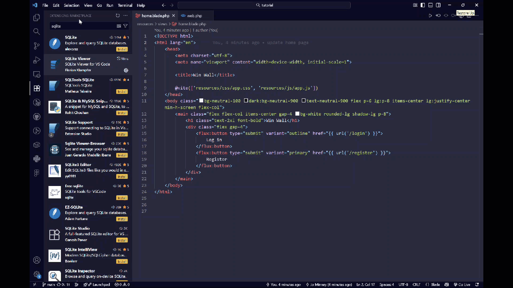
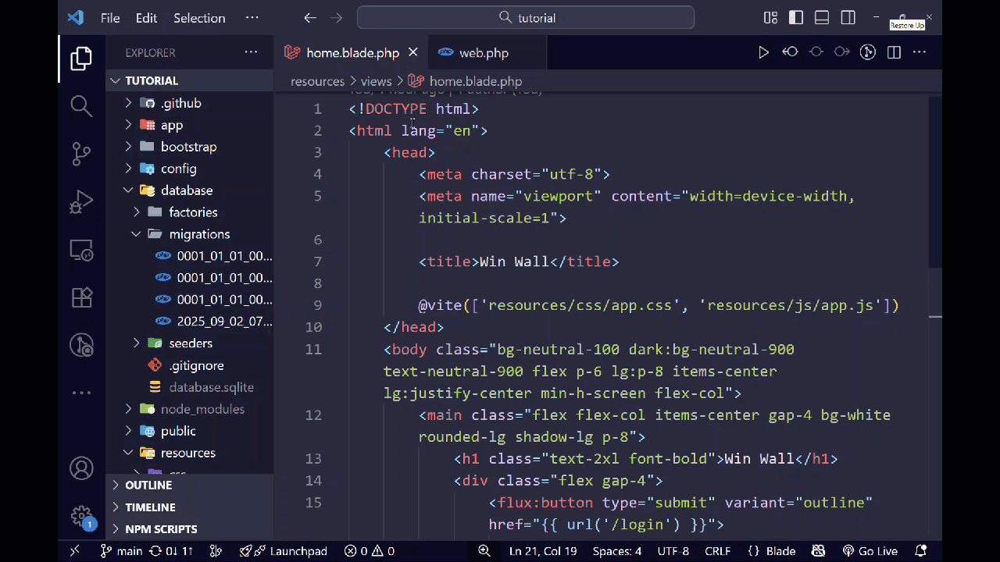
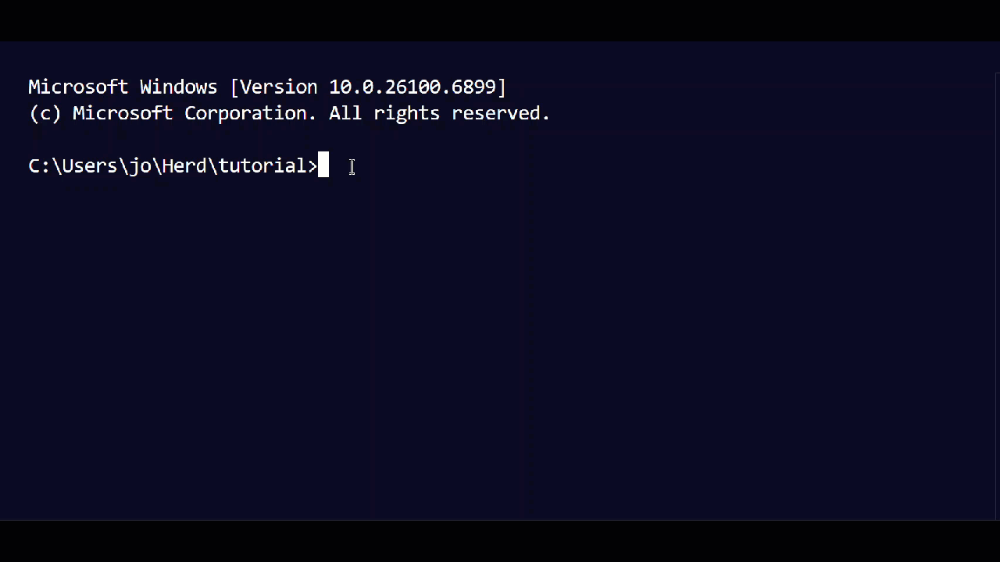

## Working with the Database

Now that we have our home page looking nice, it's time to learn about one of the most important parts of any web application: the **database**. This is where we'll store all the data for our Win Wall - for example, the wins that users post, information about who posted them, and when they were created.

### What is a Database?

Think of a database like a very fancy Excel spreadsheet, with multiple tabs. Each tab represents a table. Each row represents a record in a table, and each column represents a field.



For our Win Wall, we'll need a table to store:
- The user's win messages
- Who posted it
- When it was posted
- Maybe other details like if it's been edited, or whether it has been approved.

Our Laravel application is already set up to use **SQLite**, which is a lightweight database that's perfect for development and smaller applications. The database file is already created in your project!

### Installing the SQLite Extension

To view and inspect our database, we'll install a helpful VS Code extension. Adding VS Code extensions are like adding apps on your phone - they can be excellent for increasing productivity, but you should make sure they are trustworthy and only install what you need.  We are going to install an extension that will let us see the tables and data in our application visually.

1. In VS Code, click on the **Extensions** icon in the left sidebar (it looks like four squares, with the top right one wonky)
2. Search for "SQLite Viewer" or "SQLite"
3. Install the extension called **"SQLite Viewer"** by Florian Klampfer
4. If prompted, you will need to trust the Extension author.



{}
**Use Caution**
If you are new to coding, use caution when installing VS Code extensions. They are the equivalent of having a new piece of software installed on your computer, and it is possible to publish extensions that contain malicious code. Only use extensions you trust! In this case, we've picked an extension that has great community feedback and has been around for a long time, which you can tell by the number of downloads and the star rating.
{}

### Viewing the Database
Now that we have our extension installed, we can go ahead and open our SQLite database to have a look at it. To do this we will need to go to our File Explorer in VS Code, using the icon on the top left that looks like two pieces of paper overlapping. This is where we can go at any time to see all the files in our project.

To make life easier, you can use the 'Collapse Folders in Explorer' shortcut which will close everything, showing us only the top level folders and files. From there, go to database, then open the file called database.sqlite.



### Exploring the User Table

Your Laravel application already comes with a `users` table! This is where user account information is stored when someone registers on your site. Let's take a look at it by clicking it in the list of tables that comes up when we open our database.

The users table has several **fields** (columns):
- **id** - A unique number for each user (auto-increments automatically)
- **name** - The user's name
- **email** - The user's email address (must be unique)
- **email_verified_at** - An optional timestamp that is populated if the user verifies their email address
- **password** - The encrypted password (never stored as plain text for security!)
- **remember_token** - A unique token that is populated when the user chooses the 'Remember Me' option on login
- **created_at** - When the user account was created
- **updated_at** - When the user account was last updated
- **two_factor_secret** - Stores the secret key for two-factor authentication (if enabled)
- **two_factor_recovery_codes** - Backup codes the user can use if they lose access to their authenticator app
- **two_factor_confirmed_at** - Timestamp of when the user confirmed their two-factor authentication setup

Each **row** in this table represents one user who has registered on your site.

### Understanding Migrations

Now you might be wondering: "How did that users table get there?" The answer is **migrations**!

A **migration** is like a blueprint or instruction manual for building a database table. It describes:
- What the table should be called
- What columns (fields) it should have
- What type of data each column can store (text, numbers, dates, etc.)
- How the data links to other data (e.g. fields in other tables)

Migrations allow us to keep track of our database structure in code. It's normal for databases to grow as our application becomes more complex, and migrations allow us to do this in a manageable way. We can even start by creating simple tables, then doing incremental migrations to add new columns as we need them.

Let's look at the migration that created the users table. In VS Code, navigate to `database/migrations/` and you'll see several files. One will be named something like `0001_01_01_000000_create_users_table.php`. Open it up!

You'll see part of the code that looks something like this:

```php
Schema::create('users', function (Blueprint $table) {
    $table->id();
    $table->string('name');
    $table->string('email')->unique();
    $table->timestamp('email_verified_at')->nullable();
    $table->string('password');
    $table->rememberToken();
    $table->timestamps();
});
```

This code is creating the users table and defining a bunch of its columns.

### Opening the Terminal in VS Code

Before we can create our own migration for a databae table to store our Wins in, we need to learn how to use the **terminal** (also called command line). Don't worry - it's not as scary as it looks! It will, however, let you feel like a hacker.

TODO: Find a GIF of a hacker

The terminal is just a way to give your computer text commands instead of clicking with your mouse. Laravel includes a powerful tool called **Artisan** that we access through the terminal to do things like create migrations, create models, and more.

Here's how to open the terminal in VS Code:


{}
1. In VS Code, go to the top menu and click **Terminal → New Terminal**
2. Or use the keyboard shortcut: `Control + ` (that's the backtick key, usually above Tab in the top left of your keyboard)
3. A terminal panel will open at the bottom of VS Code
4. You should see your project path displayed

The terminal is now ready! You'll type commands here and press Enter to run them.
{}
{}
1. In VS Code, go to the top menu and click **Terminal → New Terminal**
2. Or use the keyboard shortcut: `Ctrl + ` (that's the backtick key, usually above Tab in the top left of your keyboard)
3. A terminal panel will open at the bottom of VS Code
4. You should see your project path displayed

**Important:** Make sure you're using Command Prompt, not PowerShell. If you see "PowerShell" at the top of the terminal, click the dropdown arrow next to the + sign and select "Command Prompt" instead.



The terminal is now ready! You'll type commands here and press Enter to run them.
{}


### Your First Artisan Command

Let's test out the terminal by running a simple Artisan command. In your terminal, type:

```bash
php artisan --version
```

Then press Enter. You should see Laravel's version number appear! Congratulations - you just ran your first Artisan command! 🎉



**What just happened?**
- `php` - Tells your computer to run PHP
- `artisan` - The Laravel command-line tool
- `--version` - Asks Artisan to show you the Laravel version

### Creating a Migration for Wins

Now we're ready to create our own migration for the Wins table! In your terminal, type this command:

```bash
php artisan make:migration create_wins_table
```

Press Enter, and Laravel will create a new migration file for you! You should see a message like:
```
Created Migration: 2025_11_17_123456_create_wins_table
```

**Breaking Down the Command:**
- `php artisan` - We're using Laravel's Artisan tool
- `make:migration` - We want to create a new migration
- `create_wins_table` - The name of our migration (Laravel is smart enough to understand we want to create a table called "wins")

Now find this new file in `database/migrations/` - it will have today's date and time in the filename, followed by `_create_wins_table.php`.

### Defining the Wins Table Structure

Open your new migration file. You'll see it has two methods: `up()` (which runs when we apply the migration) and `down()` (which runs if we need to undo it).

Inside the `up()` method, you'll see some starter code. Let's modify it to create our wins table. Replace the contents of the `up()` method with:

```php
public function up(): void
{
    Schema::create('wins', function (Blueprint $table) {
        $table->id();
        $table->foreignId('user_id')->constrained()->onDelete('cascade');
        $table->text('content');
        $table->timestamps();
    });
}
```

**Let's break down what each line does:**

- **`$table->id();`** - Creates an 'id' column that auto-increments for each new win
- **`$table->foreignId('user_id')->constrained()->onDelete('cascade');`** - Creates a 'user_id' column that links to the users table. When a user is deleted, their wins are also deleted (cascade)
- **`$table->text('content');`** - Creates a 'content' column to store the win message
- **`$table->timestamps();`** - Automatically creates 'created_at' and 'updated_at' columns that Laravel manages for us

### Running the Migration

Now we need to actually create this table in our database! In the terminal, run:

```bash
php artisan migrate
```

You should see output showing that your migration ran successfully! 

Now if you open your `database/database.sqlite` file in VS Code again (you might need to refresh it), you should see a new `wins` table alongside the `users` table!

{}
If you get an error about the database file not being found, make sure your terminal is in the correct directory (your project root). With Laravel Herd, the terminal should automatically open in the right place, but if you're not sure, ask a mentor for help!
{}

### Understanding Models

We have our database table, but now we need a way to easily interact with it from our PHP code. That's where **Models** come in!

A **Model** is a PHP class that represents a database table. It gives us easy methods to:
- Create new records (adding a new win)
- Read records (e.g. showing all wins)
- Update records (editing a win)
- Delete records (removing a win)

Think of a Model as a translator between your PHP code and your database. Normally to interface between our application and our database to do something like add a new win, we would need to write complicated queries in SQL - the language used to interact with most relational databases. With models, we can use simple, readable PHP methods instead.

### Creating the Win Model

Let's create a model for our wins table. In the terminal, run: 

```bash
php artisan make:model Win
```

This creates a new file at `app/Models/Win.php`. Open it up!

You'll see a pretty simple class. Let's add one thing to make it work better with our table. Inside the Win class, add this line:

```php
protected $fillable = ['user_id', 'content'];
```

Your complete Win model should look like this:

```php
<?php

namespace App\Models;

use Illuminate\Database\Eloquent\Model;

class Win extends Model
{
    protected $fillable = ['user_id', 'content'];
}
```

**What does `$fillable` do?**

This tells Laravel which fields are allowed to be mass-assigned (filled in all at once). This is a security feature - it prevents hackers from adding data to fields you didn't intend them to change!

{}
**Interesting Fact for Beginners:**
Notice how our model is called `Win` (singular) but our table is called `wins` (plural)? Laravel automatically knows to look for the plural table name! This is called "convention over configuration" - Laravel makes smart assumptions so you write less code.
{}

### Testing Our Model

Let's make sure everything works! Laravel has a cool feature called **Tinker** that lets us interact with our application from the command line. Run:

```bash
php artisan tinker
```

This opens an interactive PHP shell. Now try creating a test win (you'll need to have registered a user first to have a user_id of 1):

```php
Win::create(['user_id' => 1, 'content' => 'I learned about databases!']);
```

If everything worked, you should see your new win record displayed! You can also check your database file to see it stored there.

To exit Tinker, type `exit` and press Enter.

### What We've Learned

Congratulations! You now understand:

- ✅ What databases are and how they organize data
- ✅ How to view your SQLite database in VS Code
- ✅ What migrations are and how to create them
- ✅ How to use the terminal and Artisan commands
- ✅ What models are and how they help us work with data
- ✅ How to create a complete database table with a model

In the next section, we'll use this Wins model to actually let users post their wins on the Win Wall!


